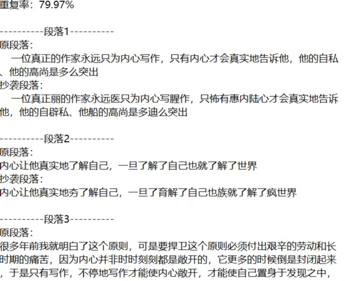

## 测试结果部分展示

### 测试一

测试内容：输入正常txt文件 orig_0.8_add.txt 的路径

输入：

```bash
# 在项目根目录输入命令行
$ python main.py dataset/orig.txt dataset/orig_0.8_add.txt dataset/ans.txt
```

结果：

成功计算出重复率，并将结果保存到 ans.txt 文件中，耗时大约 0.388s ， 部分结果如下：



### 测试二

测试内容：当输入的原论文文件不存在时，进行测试

输入：

```bash
# 在项目根目录输入命令行
$ python main.py dataset/not_exist.txt dataset/orig_0.8_add.txt dataset/ans.txt
```

结果：

提示文件不存在，并打印一下错误内容


### 测试三

测试内容：当输入的待查论文文件不存在时，进行测试

输入：

```bash
# 在项目根目录输入命令行
$ python main.py dataset/orig.txt dataset/not_exist.txt dataset/ans.txt
```

结果：

提示文件不存在，并打印一下错误内容


### 测试四

测试内容：输入正常txt文件 orig_0.8_add.txt 的路径

输入：

```bash
# 在项目根目录输入命令行
$ python main.py dataset/orig.txt dataset/orig_0.8_del.txt dataset/ans2.txt
```

结果：

成功计算出重复率，并将结果保存到 ans2.txt 文件中，耗时大约 0.348s，部分结果如下：


### 测试五

测试内容：当输入的原论文文件为空时，进行测试

输入：

```bash
# 在项目根目录输入命令行
$ python main.py dataset/empty.txt dataset/not_exist.txt dataset/ans.txt
```

结果：

提示错误结果，打印内容如下：


## 工作量报告

- 代码量：总共 222 行代码
- 总共签入 7 次
- 测试用例 10 个