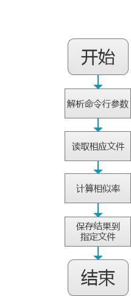

# 设计文档

>Author : Boyle
>
>Start Date : 2020-09-20
>
>Last Modified : 2020-09-20

## 功能设计

本项目要求设计一个论文查重算法，能根据给定的原文件和查重文件计算其重复率，并并将答案保存到指定的文件，主要包括以下功能：

- 接收并解析命令行参数
- 根据命令行参数指定的原文件和待查重文件，计算重复率
- 将计算的结果保存到指定的文件中

输入输出采用文件输入输出，规范如下：

- 从**命令行参数**给出：论文原文的文件的**绝对路径**。
- 从**命令行参数**给出：抄袭版论文的文件的**绝对路径**。
- 从**命令行参数**给出：输出的答案文件的**绝对路径**。

示例如下（由于该项目采用 python 编程，故此处 python 的示例）：

```bash
# 输入命令行参数
$ python main.py org.txt org_add.txt ans.txt
```

功能流程图如下：



## 模块设计

本项目主要包括以下两个模块：

| 序号 |     模块     |            说明            |
| :--: | :----------: | :------------------------: |
|  1   | 文件管理模块 | 负责文件的读取和信息的存储 |
|  2   |   计算模块   |    负责论文相似度的计算    |

各模块的主要接口如下：

### 文件管理模块

**file_utils 类**

| 序号 |   接口    |                 输入                  |        输出        |   说明   |
| :--: | :-------: | :-----------------------------------: | :----------------: | :------: |
|  1   | load_file |          file_path(文件路径)          | content(文件内容)  | 加载文件 |
|  2   | save_file | file_path(文件路径),content(文件内容) | isSucess(是否成功) | 存取文件 |

### 计算模块

**cal_utils 类**

| 序号 |    接口     |                输入                |       输出       |       说明       |
| :--: | :---------: | :--------------------------------: | :--------------: | :--------------: |
|  1   | cal_simhash | content_a(论文A)、content_b(论文B) | rate(论文重复率) | 计算论文的重复率 |