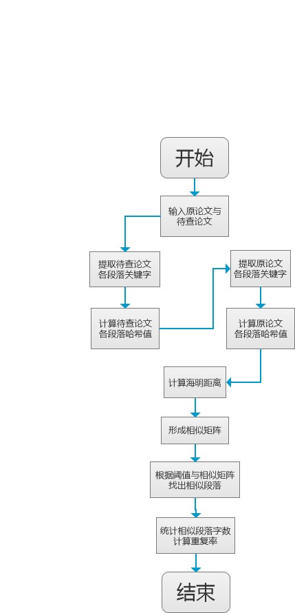

# 设计文档

>Author : Boyle
>
>Start Date : 2020-09-20
>
>Last Modified : 2020-09-23

## 功能设计

本项目要求设计一个论文查重算法，能根据给定的原文件和查重文件计算其重复率，并并将答案保存到指定的文件，主要包括以下功能：

- 接收并解析命令行参数
- 根据命令行参数指定的原文件和待查重文件，计算重复率
- 将计算的结果保存到指定的文件中

输入输出采用文件输入输出，规范如下：

- 从**命令行参数**给出：论文原文的文件的**绝对路径**。
- 从**命令行参数**给出：抄袭版论文的文件的**绝对路径**。
- 从**命令行参数**给出：输出的答案文件的**绝对路径**。

示例如下（由于该项目采用 python 编程，故此处 python 的示例）：

```bash
# 输入命令行参数
$ python main.py org.txt org_add.txt ans.txt
```

功能流程图如下：


## 模块接口设计

本项目主要包括以下两个模块：

| 序号 |     模块     |            说明            |
| :--: | :----------: | :------------------------: |
|  1   | 文件管理模块 | 负责文件的读取和信息的存储 |
|  2   |   计算模块   |    负责论文相似度的计算    |

各模块的主要接口如下：

### 文件管理模块

**file_util 类**

| 序号 |   接口    |                 输入                  |  输出  |     说明     |
| :--: | :-------: | :-----------------------------------: | :----: | :----------: |
|  1   | load_file |          file_path(文件路径)          | parags |   加载文件   |
|  2   | save_file | file_path(文件路径)，result(计算结果) |   无   | 保存计算结果 |
### 计算模块

**cal_util 类**

| 序号 |      接口       |                    输入                     |        输出        |       说明       |
| :--: | :-------------: | :-----------------------------------------: | :----------------: | :--------------: |
|  1   | cal_repeat_rate | orig_paper(论文A)、orig_modify_paper(论文B) | result(论文重复率) | 计算论文的重复率 |

## 用伪代码、流程图等方法来设计具体模块

## 模块具体设计

### 文件管理模块方法

**file_util.load_file:**

功能：加载txt文件内容

输入参数：

- file_path：读取txt文件的路径

返回值：

- parags：文件内容，即包含txt文件的字符序列的列表

**file_util.save_file:**

功能：保存文件内容，本项目将保存论文的重复率以及相似的段落

输入参数：

- file_path：文件路径
- result：文件内容，即论文查重算法的结果

返回值：

- 无

### 计算模块方法

**cal_util.cal_repeat_rate**

功能：采用SimHash算法计算论文的重复率，供主模块调用的方法，是该模块的主方法

输入参数：

- orig_paper：原论文的字符序列
- orig_modify_paper：抄袭论文的字符序列

返回值：

- result：保留计算结果的字典，包括两篇论文的重复率和重复的段落；当返回 -1 时，说明抄袭论文编码读取失败；当返回 -2 时，说明原论文编码读取失败；返回 -3 则是计算汉明距离时发生错误

算法说明：

> 此处为 SimHash 算法的简单介绍，有关 SimHash 算法的详细内容，请参考文档 “ 算法说明.md”

本算法采用 SimHash 值来计算段落的局部敏感哈希值，先采用 jieba 框架提取两篇论文的关键字及其权重，并根据关键字以及权重分别计算两篇论文各个段落的哈希值，并计算各个段落间的哈希值的海明距离，形成**相似矩阵**，根据相似矩阵以及设定好的阈值，来确定哪些段落比较相似，进而计算出待查论文与原论文的相似度，算法流程图如下：



**cal_util.str2hash**

功能：计算字符的哈希值

参数：

- orig_str：原始字符

返回值：字符的哈希值

**cal_simhash**

功能：计算字符序列的 SimHash 值

参数：

- content：字符序列

返回值：对应的 SimHash 值，NumPy 数组类型

### 异常处理

- 对文件读取方法做异常处理，发生错误时打印错误原因
- 对文件存储方法做异常处理，发生错误时打印错误原因
- 对 SimHash 值的计算作异常处理，发生错误时打印错误原因
- 对汉明距离的计算作异常处理，发生错误时打印错误原因